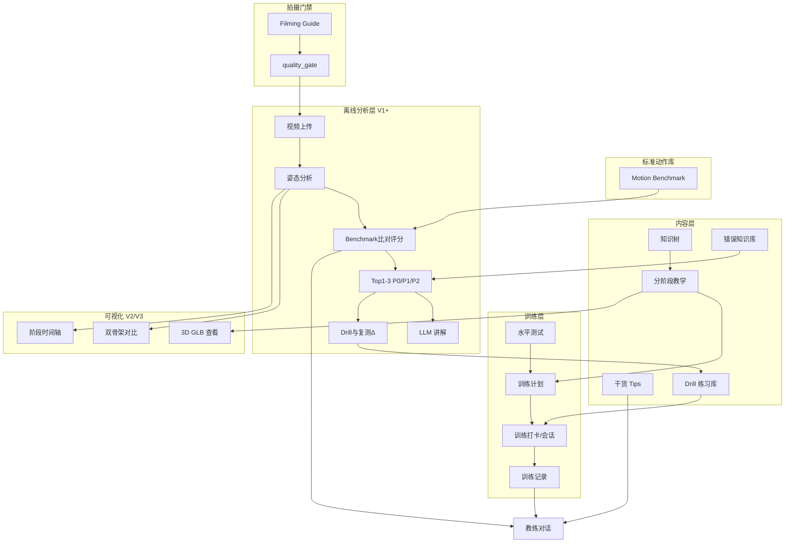
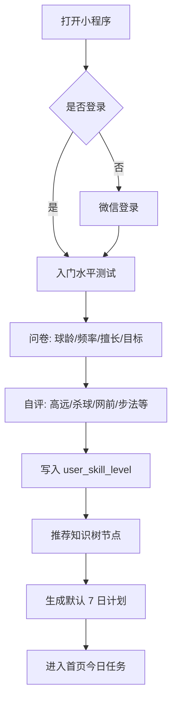
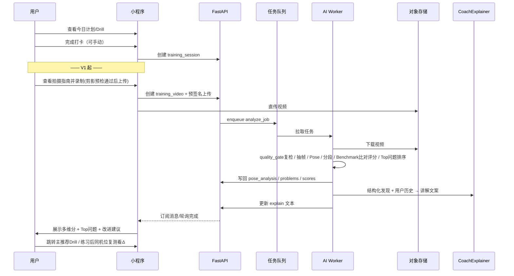
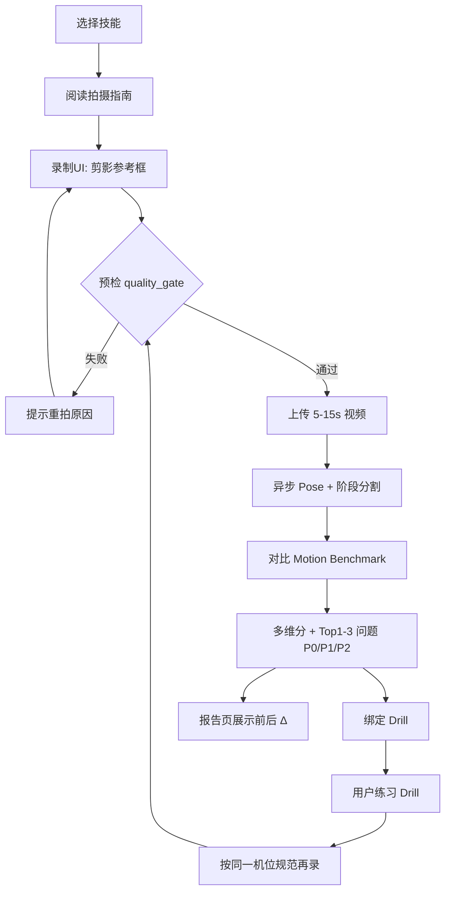
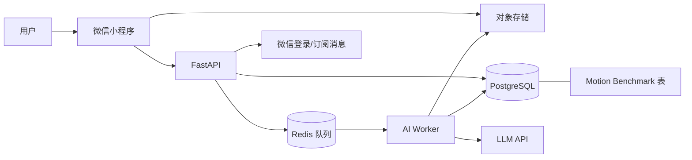

# 羽毛球 AI 学习训练助手 — 第一阶段产品/技术设计文档

> **产品名**：羽毛球 AI 学习训练助手 / 羽毛球版 AI 私人教练  
> **形态**：微信小程序 + 云端 API + 异步 AI Worker  
> **文档目的**：产品负责人评审确认后，再进入第二阶段（详细 API / 原型 / 开工）  
> **文档状态**：待确认  
> **硬约束**：标准动作库 Benchmark；禁止实时纠错；拍摄引导门禁；问题→Drill→复测  
> **日期**：2026-09-08

---

## 1. 产品分析

### 1.1 目标用户

| 细分 | 画像 | 核心痛点 | 付费意愿 |
|------|------|----------|----------|
| A. 自学爱好者 | 18–35 岁，每周打 1–3 次，无固定教练 | 动作不标准、进步慢、不知道练什么 | 中 |
| B. 进阶业余 | 有基础，想冲俱乐部/业余比赛 | 细节错误难自查、缺少对比标杆 | 高 |
| C. 青少年家长/陪练 | 为孩子找低成本辅助训练 | 教练贵、时间少、需要可跟踪的作业 | 中高 |
| D. 教练辅助工具（次级） | 私教/俱乐部教练 | 需要课后复盘、学员进度可视化 | 高（B 端） |

**第一阶段主战场：A + B。** D 作为后续 B 端扩展，不进 MVP。

### 1.2 Jobs To Be Done（JTBD）

1. **学**：系统学羽毛球技术（杀球、高远、网前等），而不是散乱短视频。
2. **练**：按计划每天知道练什么、练多久、练到什么标准。
3. **诊**：按规范离线拍摄，得到「哪里不对 + 为什么 + **现在最该练什么**」的可解释反馈。
4. **进**：Drill 后复测看到分数/问题 Δ，形成持续改进动机。

一句话：**把「找教练 → 学动作 → 布置作业 → 纠错 → 复盘」压缩成手机上的闭环。**

### 1.3 价值闭环

```
内容信任（知识树/教学） → 计划引导（7/30 日） → 训练打卡
        ↑                                              ↓
   成长可视化 ←── 问题→Drill→复测Δ ←── 离线视频分析（V1，经拍摄门禁）
```

- **冷启动靠内容**：没有 AI 也能用（知识树 + 教学 + 计划 + 错题库）。
- **留存靠分析与成长**：V1 起用姿态评分拉开与短视频号差异。
- **付费靠「诊断 + 计划个性化」**：通用内容免费/低价，深度分析与进阶计划收费。

### 1.4 竞争定位

| 类型 | 代表 | 我们的差异 |
|------|------|------------|
| 短视频/课程 | 抖音、B 站、腾讯课堂 | 结构化知识树 + 阶段化教学 + 训练闭环，不是信息流 |
| 运动 App | Keep、咕咚 | 垂直羽毛球技术细节，非泛健身 |
| 姿态类 App | 部分高尔夫/网球 AI | **自有 Motion Benchmark** + 拍摄门禁 + 可解释多维分 + 问题→Drill→复测 |
| 真人教练 | 线下私教 | 价格与频次：AI 做日常，教练做关键节点 |

**定位一句话**：微信里的「羽毛球技术操作系统」——先内容与计划站稳，再用可解释姿态分析做护城河，而不是又一个「上传视频出个模糊分数」的玩具。

### 1.5 成功指标

| 阶段 | 指标 | 目标（建议） |
|------|------|--------------|
| MVP（内容期） | 次日留存 / 7 日留存 | ≥35% / ≥15% |
| MVP | 完成入门水平测试占比 | ≥60% 新用户 |
| MVP | 计划打卡完成率（7 日） | ≥40% |
| V1 | 视频分析提交率（活跃用户/周） | ≥25% |
| V1 | 分析后 7 日内回访训练 | ≥50% |
| V1 | 报告后进入主推荐 Drill 占比 | ≥40% |
| V1 | 完成至少一次同技能复测占比 | ≥25% |
| V2+ | 付费转化（分析包/复测配额） | 视定价，先验证意愿再定 KPI |
| 质量 | 用户对「问题解释+该练什么」有用评分 | ≥4.0/5 |

**反指标**：只刷视频不训练、分析后「看不懂分数」、无 Drill 出口的死报告、绕过拍摄门禁硬评分、3D/实时炫技导致首屏卡顿或预期错位流失。

---


## 核心设计原则（硬约束，全文适用）

以下四条为产品负责人确认的**硬性设计原则**，不是可选功能。后续架构、库表、页面、MVP、风险与挑战回答均以此为准。

### 原则一：标准动作库（Badminton Motion Benchmark）是核心数据资产

Pose 模型只产出关键点，**不知道对错**。对错来自独立的 **标准动作库 / Motion Benchmark**。

每个标准技能（按版本）至少包含：名称、版本、持拍手（左/右）、机位视图、教学视频、关键点序列、阶段切分、各阶段关键帧、关节角合理区间、相对体位、重心轨迹、动作顺序、时序窗口、容差带、严重错误阈值、常见错误类型、关联纠正 Drill。

评分必须基于：**区间 + 相对位置 + 时序 + 运动趋势**，禁止仅用绝对角度一刀切。必须对身高、臂长、体段比例、柔韧近似、机位、持拍手、风格做归一化。

标准库有独立生产流程：采集 → 标注 → 入库 → 版本化 → 可增量加技能（见 §5 / §7）。

### 原则二：第一阶段禁止实时纠错

**MVP / V1 禁止**：边挥拍边实时相机姿态 + 实时语音教练。
只做准确的 **离线分析**：选技能 → 拍摄引导 → 录 5–15 秒 → 上传 → 后端 Pose → 阶段分割 → 对比 Benchmark → 报告 → Drill。
实时姿态/反馈/语音仅在 Pose / 分段 / 评分 / Benchmark **稳定之后** 进入 V3/V4。全文凡涉及实时能力一律标为远期、非本阶段范围。

### 原则三：拍摄引导系统（Filming Guidance）强制前置

录制前按技能给出 AI 拍摄指南（机位如高远球侧后方约 45°、步法后高机位等）、横竖屏、高度、距离、是否全身入镜、是否需拍/球可见、光线与背景。
录制 UI 提供人体剪影参考框；开录/上传前做预检：全身、手足入画、距离、亮度、手机倾角。
**预检失败 → 阻断 AI 评分，要求重拍。** 流水线内设 `quality_gate`。

### 原则四：问题 → Drill → 复测闭环

每个可检测问题必须绑定纠正方法 + 具体 Drill。流程：学 → 练 → 拍 → AI → 按纠正优先级（P0/P1/P2 = 严重度 × 影响 × 可修复 ROI）给出最多 1–3 个问题 → 推荐 Drill → 练习 → 再录 → 再评分 → 前后对比 Δ。
产品必须回答 **「我现在最应该练什么？」**，而不仅是「哪里错了」。

---

## 2. 功能架构图

### 2.1 模块树

```
羽毛球 AI 学习训练助手
├── 知识体系
│   ├── 知识树 / 技术树（Skill Tree）
│   ├── 技术详情（阶段、要点、常见错误）
│   ├── 教学内容块（图文 / 视频 / 要点列表）
│   └── 错误知识库（Common Error KB）
├── 教学与示范
│   ├── 分阶段教学页
│   ├── 2D 示范视频 / 骨架叠加（V1）
│   └── 3D 标准动作查看（V3）
├── 评估与训练
│   ├── 入门水平测试
│   ├── 训练计划（7/30 日）
│   ├── 训练日任务 / 打卡
│   ├── 训练记录与成长曲线
│   └── 练习 Drill 库
├── 拍摄引导与门禁（原则三，V1 强制）
│   ├── 分技能 Filming Guide
│   ├── 录制剪影参考框
│   └── 预检 quality_gate（失败阻断评分）
├── 标准动作库 Motion Benchmark（原则一）
│   ├── benchmark 版本 / 阶段 / 指标容差
│   └── 采集-标注-发布流水线
├── AI 离线姿态分析（V1+，禁止实时）
│   ├── 视频上传与异步分析
│   ├── Benchmark 比对多维评分
│   ├── Top 1–3 问题（P0/P1/P2）+ LLM 讲解
│   ├── problem→Drill→复测 Δ（原则四）
│   ├── 双人骨架同步对比（V2）
│   └── 阶段时间轴 / 时序差（V2）
├── 3D 与可视化（V3）
│   ├── GLB 骨骼动画播放
│   ├── 阶段跳转 / scrub
│   └── 关节角度 HUD
├── 教练对话
│   └── 基于结构化发现 + 用户历史的 Coach Chat
├── 干货 Tips
│   └── 短文 / 清单 / 赛前赛后建议
└── 账户与设置
    ├── 用户档案 / 水平
    └── 订阅与配额（后期）
```

### 2.2 功能关系（Mermaid）



---

## 3. 用户流程

### 3.1 主路径概览

1. **首次**：授权 → 水平测试（问卷 + 可选自评分项）→ 推荐技术树入口 + 生成 7 日计划。
2. **日常**：打开首页今日任务 → 看教学/Drill → 打卡完成。
3. **分析（V1）**：录/传视频 → 排队分析 → 看分数与 Top 问题 → 跳转对应错误 KB / 练习。
4. **改进闭环**：按问题练 → 再分析 → 成长曲线上升。

### 3.2 首次使用（Mermaid）



### 3.3 日常训练 + 视频分析改进环



### 3.4 关键原则（对齐四条硬约束）

- 首次流程 **≤ 2 分钟** 可跳过细项，允许「先逛知识树」。
- **无实时纠错**：早期版本只有离线「选技能 → 引导拍摄 → 上传 → 报告」。
- 进入拍摄前必须经过 **Filming Guidance + 预检**；预检失败不得进入评分。
- 分析等待必须有明确状态（排队中 / 分析中 / 失败可重试），禁止无限转圈。
- 报告最多 Top 1–3 问题，且每个问题必须能进入 **Drill → 复测**；否则分析无转化。
- 复测强调「同技能 + 同机位规范」，以支持前后 Δ。

### 3.5 离线诊断主路径（V1，含拍摄门禁与复测）



**明确不做（本阶段）**：挥拍过程中的实时骨架、实时语音提示、边打边纠。

---

## 4. 系统架构

### 4.1 前端选型（三选一，结论明确）

| 方案 | 优点 | 缺点 | 结论 |
|------|------|------|------|
| 微信原生 | 相机/Canvas/性能最可控；拍摄引导、剪影框、预检最易做实 | 多端复用差 | **推荐** |
| Taro | React 生态、一定多端 | 相机/Canvas/WebGL 常需原生混写 | 不推荐首发 |
| uni-app | 多端快 | 复杂视图与媒体坑多 | 不推荐首发 |

**推荐：微信原生小程序。**

**理由**：核心交互是「拍摄引导 UI、预检、视频上传、Canvas 骨架回放、后续 WebGL」。媒体与相机链路在原生侧最稳。一人/小团队应减少跨端框架泄漏到相机层。未来若做 App，再抽 API 与类型，而不是首发赌跨端。

### 4.2 后端选型

| 方案 | 说明 | 结论 |
|------|------|------|
| Java 业务 + Python AI | 边界清晰，双栈运维重 | 后期可拆 |
| **纯 Python FastAPI** | 业务 + AI 编排同语言 | **首发推荐** |

**推荐：纯 Python FastAPI，进程级拆分。**

- `services/api`：鉴权、CRUD、预签名、**拍摄指南配置下发**、分析状态、计划、聊天、复测关联。
- `services/ai-worker`：队列消费；`quality_gate`（可复检）→ Pose → Stage → **Benchmark 比对** → Scorer → 问题优先级 → Explainer。
- 共享 OpenAPI / `packages/shared-types`；同一 PostgreSQL。

**何时拆**：日分析量持续上千、多模型 A/B、或出现专职后端时。此前拆 Java 是过早优化。

### 4.3 数据与基础设施

| 组件 | 推荐 | 理由 |
|------|------|------|
| DB | **PostgreSQL** | JSONB 适合 benchmark 指标、阶段、容差；优于 MySQL 对半结构化 pose |
| 对象存储 | 腾讯云 **COS** / OSS / 本地 MinIO | 视频、全量关键点、标准动作序列大文件 |
| 队列 | Redis + ARQ/RQ/Celery | 离线分析必须异步；**禁止**把重推理放请求线程 |
| 缓存 | Redis | 指南配置、任务状态、热点 benchmark 元数据 |

### 4.4 系统上下文（Mermaid）



要点：小程序先拉 **filming guide**；预签名直传 COS；Worker 只做离线管线；Benchmark 与业务库同库但逻辑资产独立版本化。

---

## 5. AI 架构

### 5.1 总原则

- 小程序 **不跑重模型**；也不做 Phase1 实时纠错。
- Pose 只是感知层；**正确性来自 Motion Benchmark 比对**。
- 无通过 `quality_gate` 的视频 **不评分**（可存草稿，但不产出正式报告）。

### 5.2 离线分析流水线（V1）

```
选技能 → 下发 filming_guide → 录制(剪影框) → 客户端预检
  → 上传 COS → 入队
  → Worker: 可选服务端复检 quality_gate
  → OpenCV 抽帧
  → PoseAnalyzer（MediaPipe Pose；适配器可换 RTMPose）
  → 人体比例/机位归一化
  → StageSegmenter（对齐 benchmark 阶段定义）
  → Scorer vs motion_benchmark（区间+相对位姿+时序+趋势）
  → 问题候选 → Correction Priority 排序 → Top 1–3
  → 映射 problem_to_drill
  → CoachExplainer（仅基于结构化 findings + KB + 用户历史）
  → 若存在 baseline 分析则计算 before/after Δ
  → 写库通知小程序
```

**明确不在管线内**：实时 RTMP/WebRTC 推流、边录边推理播报、挥拍中语音纠错。

### 5.3 适配器接口

| 接口 | 职责 |
|------|------|
| `FilmingGuideService` | 按 skill + handedness 返回指南与预检阈值 |
| `QualityGate` | 全身/距离/亮度/倾角/关键点覆盖；失败则 `block_scoring` |
| `PoseAnalyzer` | 帧 → keypoints + 置信度 |
| `Normalizer` | 身高/臂长/比例/左右手镜像/粗略机位校正 |
| `StageSegmenter` | 按 benchmark 阶段切分 |
| `BenchmarkMatcher` / `Scorer` | 区间、相对位置、时序窗、趋势；输出多维分与 evidence |
| `ProblemRanker` | severity × impact × fix_ROI → P0/P1/P2，截断 1–3 |
| `DrillRecommender` | problem → drill 映射 |
| `CoachExplainer` | 结构化讲解；禁止无 evidence 断言 |

### 5.4 标准动作库：采集 / 标注 / 存储 / 版本 / 增量

1. **采集**：按 filming_guide 同机位录制高水平示范（可多条取代表）；记录持拍手、机位、设备、身高备注。
2. **标注**：阶段边界、关键帧、容差带、严重阈值、常见错误标签；工具可以是内部标注 JSON + 审核。
3. **存储**：元数据进 PG（`motion_benchmark*`）；稠密关键点序列进 COS；教学视频进 COS。
4. **版本**：`benchmark_version` 单调；分析行记录所用 `benchmark_version_id`，保证历史报告可复现。
5. **加新技能**：先上内容教学（MVP）→ 补 filming_guide → 补 benchmark v1 → 才开放该技能 AI 评分。无 benchmark 的技能只展示教学内容，灰掉「AI 诊断」。

### 5.5 评分逻辑（反「绝对角度伪科学」）

- 使用 **角度区间 / 相对向量 / 相位时序 / 曲线趋势**（例如髋肩旋转差随阶段变化），结合容差带。
- Normalizer 处理体型与左右手；机位偏差过大时 quality_gate 直接拒识，而不是硬凹分。
- 输出必须带 evidence（阶段、帧、指标、相对 benchmark 带）。

### 5.6 能力演进

| 阶段 | 能力 |
|------|------|
| MVP | 无 AI 评分；可先沉淀 filming_guide 文案与错误 KB |
| V1 | 人体骨架 + Benchmark 离线评分 + Drill 闭环 |
| V2 | 双骨架对比、阶段时间轴 Δt |
| V3 | 3D GLB；**仍默认离线** |
| V4+ | 可选近实时（仅当 Benchmark/评分稳定）；球拍/球 YOLO 另里程碑 |

### 5.7 通用 Pose 局限（摘要）

握拍与拍面不可见、快速模糊、遮挡、无球时击球质量只能间接推断——故承诺是「可解释的动作结构问题 + 该练什么」，不是「看清拍面所有细节」。

---

## 6. 3D 架构

### 6.1 技术评估

| 方案 | 说明 | 评价 |
|------|------|------|
| 微信 WebGL | 基础可用 | 需自管引擎 |
| Three.js | Web 主流 | 不可直接塞进小程序 |
| **threejs-miniprogram** | 适配版 | **首选运行时** |
| glTF/GLB | 标准格式 | **资产交付标准** |
| FBX | 制作侧 | 须转 GLB |
| web-view | H5 兜底 | Fallback |

### 6.2 推荐

- 标准示范资产：GLB + 骨骼动画；阶段 marker 与 `benchmark_stage.code` **同名对齐**。
- 小程序优先 threejs-miniprogram；若延期，**2D 骨架叠加 + 示范视频**可支撑教学与报告回放。
- 3D 是教学增强，**不替代 Benchmark**；也不得暗示「实时 3D 纠错」。

### 6.3 动捕 vs 关键帧（服务 Benchmark 生产）

| 方式 | 用途 |
|------|------|
| 动捕/高质量捕捉 | 3–5 个核心击球的 benchmark 序列与 3D |
| 关键帧 | 长尾技能覆盖与示意 |

混合策略：核心技能高质量；长尾保证进度。Benchmark 数值层可先于漂亮 3D 上线。

---

## 7. 数据库设计

### 7.1 存储策略

- 视频原片、全量逐帧关键点、标准动作稠密序列 → **对象存储**。
- 业务摘要、分数、问题、阶段、**benchmark 元数据与指标容差** → **PostgreSQL**。
- 用户 pose：COS 全量 JSON + 表内 JSONB 摘要；避免千万级 `pose_keypoint` 行（读模式是按次取整段）。

### 7.2 核心业务表（DDL 草图）

```sql
CREATE TABLE app_user (
  id BIGSERIAL PRIMARY KEY,
  openid TEXT NOT NULL UNIQUE,
  unionid TEXT,
  nickname TEXT,
  avatar_url TEXT,
  handedness TEXT DEFAULT "right", -- right/left
  created_at TIMESTAMPTZ NOT NULL DEFAULT now(),
  updated_at TIMESTAMPTZ NOT NULL DEFAULT now()
);

CREATE TABLE skill_category (
  id SERIAL PRIMARY KEY,
  code TEXT NOT NULL UNIQUE,
  name TEXT NOT NULL,
  sort_order INT NOT NULL DEFAULT 0
);

CREATE TABLE badminton_skill (
  id SERIAL PRIMARY KEY,
  category_id INT NOT NULL REFERENCES skill_category(id),
  code TEXT NOT NULL UNIQUE,
  name TEXT NOT NULL,
  level_min SMALLINT DEFAULT 1,
  summary TEXT,
  cover_url TEXT,
  ai_enabled BOOLEAN NOT NULL DEFAULT false, -- 无 benchmark 则 false
  sort_order INT NOT NULL DEFAULT 0,
  is_published BOOLEAN NOT NULL DEFAULT false
);

CREATE TABLE skill_stage (
  id SERIAL PRIMARY KEY,
  skill_id INT NOT NULL REFERENCES badminton_skill(id),
  code TEXT NOT NULL,
  name TEXT NOT NULL,
  sort_order INT NOT NULL,
  tip_text TEXT,
  UNIQUE(skill_id, code)
);

CREATE TABLE skill_content_block (
  id BIGSERIAL PRIMARY KEY,
  skill_id INT NOT NULL REFERENCES badminton_skill(id),
  stage_id INT REFERENCES skill_stage(id),
  block_type TEXT NOT NULL,
  title TEXT,
  body TEXT,
  media_url TEXT,
  sort_order INT NOT NULL DEFAULT 0
);

CREATE TABLE common_error (
  id SERIAL PRIMARY KEY,
  skill_id INT REFERENCES badminton_skill(id),
  code TEXT NOT NULL UNIQUE,
  title TEXT NOT NULL,
  description TEXT NOT NULL,
  fix_steps TEXT NOT NULL,
  default_severity TEXT NOT NULL DEFAULT "P1", -- P0/P1/P2
  impact_weight NUMERIC(4,2) DEFAULT 1.0,
  fix_roi NUMERIC(4,2) DEFAULT 1.0
);

CREATE TABLE tip_article (
  id SERIAL PRIMARY KEY,
  title TEXT NOT NULL,
  summary TEXT,
  body TEXT NOT NULL,
  tags TEXT[],
  published_at TIMESTAMPTZ,
  is_published BOOLEAN NOT NULL DEFAULT false
);

CREATE TABLE drill (
  id SERIAL PRIMARY KEY,
  skill_id INT REFERENCES badminton_skill(id),
  title TEXT NOT NULL,
  description TEXT,
  duration_sec INT,
  intensity SMALLINT,
  media_url TEXT,
  success_criteria TEXT
);

-- 原则四：问题 → Drill 映射
CREATE TABLE problem_to_drill (
  id SERIAL PRIMARY KEY,
  error_code TEXT NOT NULL REFERENCES common_error(code),
  drill_id INT NOT NULL REFERENCES drill(id),
  priority_boost NUMERIC(4,2) DEFAULT 0,
  is_primary BOOLEAN NOT NULL DEFAULT true,
  UNIQUE(error_code, drill_id)
);

CREATE TABLE training_plan (
  id SERIAL PRIMARY KEY,
  code TEXT UNIQUE,
  title TEXT NOT NULL,
  days INT NOT NULL,
  audience TEXT,
  is_template BOOLEAN NOT NULL DEFAULT true
);

CREATE TABLE training_plan_day (
  id BIGSERIAL PRIMARY KEY,
  plan_id INT NOT NULL REFERENCES training_plan(id),
  day_index INT NOT NULL,
  title TEXT,
  skill_id INT REFERENCES badminton_skill(id),
  drill_id INT REFERENCES drill(id),
  target_reps INT,
  note TEXT,
  UNIQUE(plan_id, day_index)
);

CREATE TABLE training_session (
  id BIGSERIAL PRIMARY KEY,
  user_id BIGINT NOT NULL REFERENCES app_user(id),
  plan_day_id BIGINT REFERENCES training_plan_day(id),
  skill_id INT REFERENCES badminton_skill(id),
  drill_id INT REFERENCES drill(id),
  status TEXT NOT NULL DEFAULT "completed",
  note TEXT,
  source TEXT NOT NULL DEFAULT "manual", -- manual/video/drill
  trained_at TIMESTAMPTZ NOT NULL DEFAULT now()
);
CREATE INDEX idx_session_user_time ON training_session(user_id, trained_at DESC);

CREATE TABLE filming_guide (
  id SERIAL PRIMARY KEY,
  skill_id INT NOT NULL REFERENCES badminton_skill(id),
  handedness TEXT NOT NULL DEFAULT "right",
  camera_view TEXT NOT NULL,          -- e.g. rear_side_45
  orientation TEXT NOT NULL,          -- landscape/portrait
  phone_height_hint TEXT,
  distance_hint TEXT,
  full_body_required BOOLEAN NOT NULL DEFAULT true,
  racket_visible_preferred BOOLEAN DEFAULT true,
  shuttle_visible_preferred BOOLEAN DEFAULT false,
  lighting_hint TEXT,
  background_hint TEXT,
  silhouette_asset_url TEXT,
  preflight_rules JSONB NOT NULL,     -- thresholds
  UNIQUE(skill_id, handedness, camera_view)
);

CREATE TABLE training_video (
  id BIGSERIAL PRIMARY KEY,
  user_id BIGINT NOT NULL REFERENCES app_user(id),
  skill_id INT REFERENCES badminton_skill(id),
  session_id BIGINT REFERENCES training_session(id),
  guide_id INT REFERENCES filming_guide(id),
  cos_key TEXT NOT NULL,
  duration_ms INT,
  width INT,
  height INT,
  preflight_passed BOOLEAN,
  preflight_detail JSONB,
  status TEXT NOT NULL DEFAULT "uploaded",
  -- uploaded/blocked_quality/queued/processing/done/failed
  fail_reason TEXT,
  retest_of_analysis_id BIGINT,       -- 复测关联
  created_at TIMESTAMPTZ NOT NULL DEFAULT now()
);
CREATE INDEX idx_video_user ON training_video(user_id, created_at DESC);
CREATE INDEX idx_video_status ON training_video(status);

CREATE TABLE pose_analysis (
  id BIGSERIAL PRIMARY KEY,
  video_id BIGINT NOT NULL UNIQUE REFERENCES training_video(id),
  benchmark_version_id BIGINT,        -- FK added below
  model_name TEXT NOT NULL,
  model_version TEXT,
  keypoints_cos_key TEXT,
  keypoints_summary JSONB,
  stages JSONB,
  overall_score NUMERIC(5,2),
  quality_gate JSONB,
  created_at TIMESTAMPTZ NOT NULL DEFAULT now()
);

CREATE TABLE pose_problem (
  id BIGSERIAL PRIMARY KEY,
  analysis_id BIGINT NOT NULL REFERENCES pose_analysis(id),
  error_code TEXT REFERENCES common_error(code),
  title TEXT NOT NULL,
  severity SMALLINT NOT NULL,
  impact NUMERIC(4,2),
  fix_roi NUMERIC(4,2),
  priority_score NUMERIC(6,2) NOT NULL,
  priority_label TEXT NOT NULL,       -- P0/P1/P2
  evidence JSONB,
  recommended_drill_id INT REFERENCES drill(id),
  rank_no SMALLINT NOT NULL          -- 1..3
);
CREATE INDEX idx_problem_analysis ON pose_problem(analysis_id);

CREATE TABLE training_score (
  id BIGSERIAL PRIMARY KEY,
  analysis_id BIGINT NOT NULL REFERENCES pose_analysis(id),
  dimension TEXT NOT NULL,
  score NUMERIC(5,2) NOT NULL,
  weight NUMERIC(4,2) DEFAULT 1.0,
  detail JSONB
);
CREATE INDEX idx_score_analysis ON training_score(analysis_id);

CREATE TABLE training_progress (
  id BIGSERIAL PRIMARY KEY,
  user_id BIGINT NOT NULL REFERENCES app_user(id),
  skill_id INT NOT NULL REFERENCES badminton_skill(id),
  last_score NUMERIC(5,2),
  best_score NUMERIC(5,2),
  sessions_cnt INT NOT NULL DEFAULT 0,
  last_analysis_id BIGINT,
  updated_at TIMESTAMPTZ NOT NULL DEFAULT now(),
  UNIQUE(user_id, skill_id)
);

CREATE TABLE user_skill_level (
  id BIGSERIAL PRIMARY KEY,
  user_id BIGINT NOT NULL REFERENCES app_user(id),
  skill_id INT REFERENCES badminton_skill(id),
  level_code TEXT NOT NULL,
  source TEXT NOT NULL,
  assessed_at TIMESTAMPTZ NOT NULL DEFAULT now()
);
CREATE INDEX idx_user_level ON user_skill_level(user_id);

CREATE TABLE coach_chat_message (
  id BIGSERIAL PRIMARY KEY,
  user_id BIGINT NOT NULL REFERENCES app_user(id),
  role TEXT NOT NULL,
  content TEXT NOT NULL,
  ref_analysis_id BIGINT REFERENCES pose_analysis(id),
  created_at TIMESTAMPTZ NOT NULL DEFAULT now()
);
CREATE INDEX idx_chat_user_time ON coach_chat_message(user_id, created_at DESC);

-- 复测对比
CREATE TABLE analysis_retest_link (
  id BIGSERIAL PRIMARY KEY,
  baseline_analysis_id BIGINT NOT NULL REFERENCES pose_analysis(id),
  retest_analysis_id BIGINT NOT NULL REFERENCES pose_analysis(id),
  score_delta NUMERIC(5,2),
  problem_deltas JSONB,
  created_at TIMESTAMPTZ NOT NULL DEFAULT now(),
  UNIQUE(retest_analysis_id)
);
```

### 7.3 Motion Benchmark 表（原则一）

```sql
CREATE TABLE motion_benchmark (
  id BIGSERIAL PRIMARY KEY,
  skill_id INT NOT NULL REFERENCES badminton_skill(id),
  name TEXT NOT NULL,
  handedness TEXT NOT NULL,           -- left/right
  camera_view TEXT NOT NULL,
  teaching_video_cos_key TEXT,
  keypoints_cos_key TEXT,             -- 标准关键点序列
  cog_trajectory JSONB,               -- 或 COS 引用
  action_order JSONB,                 -- 阶段/子动作顺序
  style_notes TEXT,
  is_active BOOLEAN NOT NULL DEFAULT false
);

CREATE TABLE benchmark_version (
  id BIGSERIAL PRIMARY KEY,
  benchmark_id BIGINT NOT NULL REFERENCES motion_benchmark(id),
  version TEXT NOT NULL,              -- semver or v1/v2
  changelog TEXT,
  published_at TIMESTAMPTZ,
  is_published BOOLEAN NOT NULL DEFAULT false,
  UNIQUE(benchmark_id, version)
);

ALTER TABLE pose_analysis
  ADD CONSTRAINT fk_analysis_benchmark_ver
  FOREIGN KEY (benchmark_version_id) REFERENCES benchmark_version(id);

CREATE TABLE benchmark_stage (
  id BIGSERIAL PRIMARY KEY,
  benchmark_version_id BIGINT NOT NULL REFERENCES benchmark_version(id),
  code TEXT NOT NULL,                 -- 与 skill_stage.code 对齐
  name TEXT NOT NULL,
  t_start_ms INT,
  t_end_ms INT,
  keyframe_t_ms INT,
  keyframe_pose JSONB,
  timing_window_ms INT,               -- 允许时间窗
  sort_order INT NOT NULL,
  UNIQUE(benchmark_version_id, code)
);

CREATE TABLE benchmark_metric (
  id BIGSERIAL PRIMARY KEY,
  benchmark_version_id BIGINT NOT NULL REFERENCES benchmark_version(id),
  stage_code TEXT,
  metric_code TEXT NOT NULL,          -- shoulder_hip_diff / elbow_angle / ...
  metric_type TEXT NOT NULL,          -- angle_range/relative_pos/timing/trend
  unit TEXT,
  range_min NUMERIC,
  range_max NUMERIC,
  tolerance_band JSONB,
  severe_error_threshold JSONB,
  normalize_rule JSONB,               -- height/arm/handedness/camera
  weight NUMERIC(4,2) DEFAULT 1.0
);
CREATE INDEX idx_benchmark_metric_ver ON benchmark_metric(benchmark_version_id);
```

### 7.4 索引与 Blob 策略摘要

- 高频索引：session/video/problem/progress；benchmark 按 skill + version 查。
- COS：`videos/{user}/{id}/origin.mp4`、`pose/{analysis}/keypoints.json`、`benchmarks/{id}/{ver}/keypoints.json`。
- 原片可 30–90 天冷存；分析摘要与 benchmark 版本长期保留。

---

## 8. 页面设计

### 8.1 信息架构（IA）

```
Tab1 首页        Tab2 技术树      Tab3 训练       Tab4 我的
├ 今日任务        ├ 分类/树       ├ 当前计划      ├ 成长曲线
├ 最该练什么      ├ 技能详情      ├ Drill 库      ├ 历史分析/复测Δ
├ 继续训练        ├ 阶段教学      ├ 拍摄引导入口  ├ 教练对话
└ Tips            └ 错误库        └ 离线分析/报告 └ 设置/持拍手
```

### 8.2 关键页面

| 页面 | 目标 | 要点 |
|------|------|------|
| 首页 | 今天练什么 / 最该练什么 | 今日任务；若有未完成 P0 问题，置顶 Drill |
| 技术树 | 全局感 | AI 诊断未开放的技能标注「教学可学，诊断待开放」 |
| 技能详情 | 信任 | 阶段、错误、示范；入口「按规范拍摄并诊断」 |
| 分阶段教学 | 学会 | 阶段条 + 要点 + 视频；V3 可嵌 3D |
| **拍摄指南页** | 拍对 | 机位图示、横竖屏、距离、光线；检查清单 |
| **录制页** | 过门禁 | 剪影参考框；实时预检指示（非实时纠动作）；失败阻断上传评分 |
| 计划 | 路径 | 7/30 日 |
| 训练/Drill 会话 | 执行 | 关联来源问题；完成后引导「去复测」 |
| **分析报告** | 诊断+行动 | 可解释多维分；Top1–3 + P0/P1/P2；主推荐 Drill；复测入口；前后 Δ |
| 对比（V2） | 看差距 | 双骨架；非实时 |
| 历史/成长 | 动机 | 同机位复测序列 |
| 教练对话 | 答疑 | 只引用 findings / KB / Drill，禁空聊动作断言 |
| Tips | 轻内容 | 列表详情 |

### 8.3 视觉风格

专业运动科技：清晰字阶、克制配色、高对比骨架线；不做霓虹炫技；录制页以「拍清楚」为第一视觉任务。

---

## 9. MVP 划分

### 9.1 再评估结论

不可把「实时纠错 + 全技能 3D + 无 Benchmark 的模糊打分」塞进第一版。  
顺序必须是：**内容与计划闭环 → 拍摄规范资产 → Benchmark + 离线可解释分析 → 对比 → 3D →（很久以后）实时**。

### 9.2 版本切片

| 版本 | 范围 | 目标 |
|------|------|------|
| **MVP** | 知识树 + 教学（2D/视频）+ 水平测试 + 7/30 计划 + Drill + 手动打卡 + 错误 KB + Tips；**可先上 filming_guide 文案（即使尚无 AI）** | 验证留存与内容 |
| **V1** | 拍摄引导 + 预检门禁 + 上传 5–15s + MediaPipe 服务端 Pose + **Benchmark 比对** + 可解释多维分 + Top1–3（P0/P1/P2）+ problem_to_drill + 复测 Δ + 成长曲线 | 验证诊断→行动闭环 |
| **V2** | 双骨架同步对比 + overlay + 阶段时间轴时序差 | 提升可感知差距 |
| **V3** | 3D GLB + 阶段跳转 + 角度 HUD（离线教学向） | 沉浸教学 |
| **V4+** | 近实时相机/语音纠错（可选，须单独论证） | 仅当离线链路稳定 |

### 9.3 「第一版不做」（强制）

- **任何实时/边打边纠/实时语音教练**（原则二）
- 无 Benchmark 的「玄学总分」
- 球拍/羽毛球检测与轨迹
- 全技术树 3D 动捕
- 社交信息流、B 端排课收银、海外 App
- 无结构化依据的 AI 闲聊挥拍
- 跳过拍摄预检直接评分

---

## 10. 技术风险

| 风险 | 影响 | 缓解 |
|------|------|------|
| 无 Benchmark 却上线评分 | 伪 AI，信任崩盘 | 无 `ai_enabled` 不开放诊断；评分只对 published benchmark_version |
| 绝对角度打分 | 误伤体型差异用户 | 区间+相对位置+时序+趋势；Normalizer |
| 姿态精度/遮挡/机位 | 错切阶段、错问题 | quality_gate；拒识；机位指南；置信度门控 |
| 用户不按指南拍 | 废片率高 | 剪影框+预检阻断；文案示例图 |
| 微信包体/相机/WebGL 限制 | 体验失败 | 原生；资源 CDN；3D 可降级 |
| 视频+推理成本 | 负毛利 | 时长 5–15s、分辨率上限、日配额、异步限流 |
| 内容与 Benchmark 生产瓶颈 | AI 技能少 | 先 3 个技能打穿采集标注版控；教学可多于可评 |
| 3D 资产管道 | 延期 | 2D 兜底；marker 对齐 stage code |
| LLM 幻觉 | 伪教练 | 只消费 findings+KB+Drill；无 evidence 不断言 |
| 过早做实时 | 工程与口碑双杀 | 原则二；V4 前不排期 |

---

## 11. 项目目录结构（Monorepo 草图）

```
badminton-ai-coach/
├── apps/
│   └── miniprogram/           # 微信原生（含拍摄引导/录制预检页）
├── services/
│   ├── api/                   # FastAPI：业务、guide、报告、复测
│   └── ai-worker/             # quality_gate/pose/stage/benchmark/score
├── packages/
│   ├── shared-types/
│   └── openapi/
├── docs/                      # 设计与标注规范、Benchmark 手册
├── infra/                     # compose：PG/Redis/MinIO
└── scripts/                   # 内容导入、benchmark 发布、烟测
```

本地 Docker 起 PG + Redis + MinIO；api 与 ai-worker 分进程同学库。

---

## 12. 主动挑战设计（10 问）

### 12.1 最难的三个技术问题

1. **Benchmark 驱动的阶段分割与比对**：关键点不等于对错；要在归一化后用区间/相对位姿/时序/趋势对齐模板，并在遮挡与机位偏差下稳定出 Top 问题——难在标注体系与拒识策略，不在调一个 Pose 模型。
2. **拍摄条件可控化**：指南 + 预检 + 服务端 quality_gate 必须把「废片」挡在评分前，否则 Scorer 再强也是噪音放大器。
3. **问题优先级与复测可比性**：P0/P1/P2 要融合严重度、对击球影响、可练 ROI；复测要同技能同机位规范，否则 Δ 不可信。

### 12.2 看起来简单其实很难的功能

- 「和标准动作对比」：DTW/时间规整、比例归一、左右手镜像、帧率不一致。
- 「打个分数」：无 evidence 与容差带的分数是信任毒药。
- 「拍一下就能分析」：其实 80% 是拍摄引导与预检产品活。
- 「教练聊聊」：无 findings 接地的 LLM 会胡说挥拍。
- 「推荐一个练习」：需要 problem_to_drill 与优先级，而不是相关视频推荐。

### 12.3 第一版不应该做的

见 **§9.3**。强调：**实时相机纠错 / 实时语音教练绝对不做**；无 Benchmark 的 AI 评分不做；跳过拍摄门禁不做。

### 12.4 姿态矫正做到什么程度才不会变成伪 AI

同时满足：

1. 对错来自 **published Motion Benchmark**，并记录 `benchmark_version_id`。
2. 每个主问题有 **阶段 + 指标 + 相对容差 evidence**。
3. 低质量拍摄 **拒识**，不给中庸分。
4. Top 问题 ≤3，且绑定 Drill，并支持复测 Δ。
5. 评分用区间/相对/时序/趋势，而非绝对角度一刀切。

只出「流畅度 80」= 伪 AI。

### 12.5 普通 Pose 模型在羽毛球中的局限

- 腕内/握拍/拍面基本不可见。
- 高速模糊导致抖动；需平滑与鲁棒统计。
- 侧身与交叉步遮挡使阶段切分失败率上升。
- 无拍无球时无法直接量击球点与线路。
- 机位与镜头畸变破坏几何可比性 → 更依赖 filming guide 与 gate。

故 Pose 是传感器；Benchmark 才是老师。

### 12.6 3D：真实动捕还是人工动画

**混合**。核心 3–5 拍：动捕（同时服务 Benchmark 序列与 3D）；长尾：关键帧。Benchmark 数值可先于 3D 美观度上线。全量动捕会卡死内容；全关键帧则顶尖用户不买账。

### 12.7 一个开发者三个月该做到什么

| 月份 | 交付 |
|------|------|
| 月 1 | 原生小程序骨架、登录、知识树、3–5 技能教学、水平测试、7 日计划、手动打卡、错误 KB/Tips；filming_guide 配置结构；PG 部署 |
| 月 2 | 内容扩到 ~10 技能；**打穿 1 个技能的采集→标注→benchmark v1**；上传+队列+MediaPipe；拍摄预检 MVP |
| 月 3 | **2–3 个技能**可离线诊断；多维分+Top1–3+P 级+Drill 映射+复测 Δ；限流与配额；小范围意愿验证 |

不承诺：实时纠错、V2 对比完美、V3 全树 3D。

### 12.8 最低成本可做到什么效果

- 仅 MVP 内容产品（无 AI）即可验证学习/计划需求。
- 最低 AI：1 技能 + 严格拍摄门禁 + ≤10–15s + MediaPipe + 手工标注 benchmark + Drill 闭环；2D Canvas 回放即可。
- 砍 3D、砍实时、砍多模型。

### 12.9 商业化最值得收费的能力

1. **可解释离线诊断报告 + 复测配额**（替代部分私教纠错频次）。
2. **薄弱点驱动的计划/Drill 包**（回答「最该练什么」）。
3. 后期教练端学员报告。

不主卖：纯图文课、无接地聊天次数、未成熟的实时纠错订阅。

### 12.10 用户没想到但很重要的功能

1. 拍摄指南 + 剪影预检（比模型精度更影响体验）。
2. 诚实的「无法判断 / 请重拍」。
3. 问题 → 主 Drill → 复测 Δ。
4. 持拍手与镜像开关。
5. 同机位复测提醒。
6. benchmark 版本公示（报告可追溯）。
7. 隐私与他人入镜提示。
8. 「最该练什么」首页入口（原则四产品化）。

---

## 请确认后进入第二阶段

| # | 确认项 | 当前推荐 |
|---|--------|----------|
| 1 | 前端栈 | **微信原生小程序** |
| 2 | 后端栈 | **纯 Python FastAPI**（api + ai-worker）；暂不引入 Java |
| 3 | 数据库 | **PostgreSQL** + JSONB；视频/全量关键点/标准序列进对象存储 |
| 4 | 对象存储 | 生产倾向 **腾讯云 COS**；本地 MinIO |
| 5 | 四条硬原则 | Benchmark 核心资产；**禁止实时纠错**；拍摄引导强制；问题→Drill→复测 |
| 6 | MVP 范围 | 内容+计划+打卡+KB+Tips（+指南文案）；**无实时、无 3D、无无基准评分** |
| 7 | V1 先做的 3 个 Benchmark 技能 | **正手高远、正手杀球、网前搓球**（可改） |
| 8 | 第一版不做 | 同意 §9.3（含实时纠错） |
| 9 | 3D 策略 | V3；GLB；可降级 2D；不替代 Benchmark |
| 10 | 商业化初焦 | 诊断/复测配额 + 进阶 Drill/计划 |
| 11 | 下一阶段产出 | 线框、OpenAPI、内容导入格式、**Benchmark 标注规范**、拍摄指南配置样例 |

确认或标注修改项后，进入第二阶段详细设计与开工准备。

---

**文档结束。**
